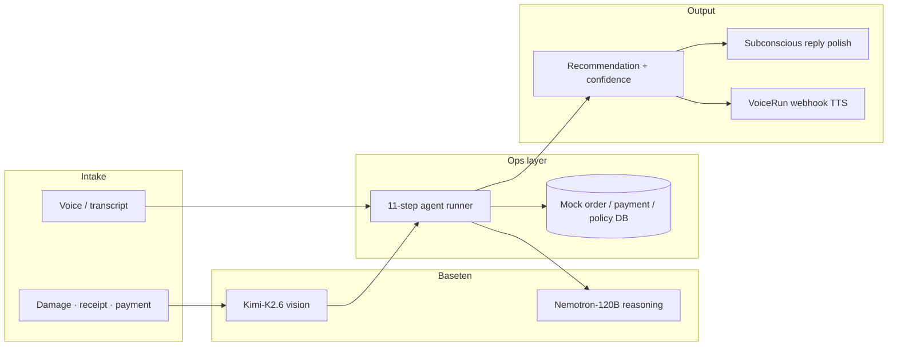

# ClaimLens

**Track winner · Customer Service & FinOps** — [Beat The Clock Agent Hack](https://hack.subconscious.dev) · Boston Tech Week 2026

Multimodal voice agent that turns customer calls, damage photos, receipts, and payment screenshots into verified refund or warranty resolutions — with confidence scoring, policy reasoning, and a full audit trail.

[**Live showcase**](https://hack.subconscious.dev/hacks/claimlens) · [**All hack projects**](https://hack.subconscious.dev)

---

## Team

| Name | |
|------|--|
| **Lagnajeet Panigrahi** | |
| **Sanat Patki** | |
| **Vasudevan Lakshmanan** | |

Built at Wayfair HQ during the Beat The Clock sprint (2 hours), sponsored by **Wayfair**, **Subconscious**, **Baseten**, and **Cloudflare**.

---

## Problem

Customer service claims are messy. Customers call in emotionally, upload blurry photos, mention duplicate charges, and expect fast answers — while reps manually cross-reference orders, payments, shipping, and policy docs across disconnected systems.

ClaimLens gives support teams a single agentic workflow: **voice + vision + internal records → structured recommendation → empathetic reply → human approval**.

---

## Demo scenario

> *"Hi, I ordered a dining chair and it arrived yesterday with a cracked leg. I also see two charges on my card for the same amount. I need this fixed today."*

The agent:

1. Captures the claim by **voice** (Web Speech API) or text
2. **Inspects evidence** — damage photo, receipt, payment screenshot
3. **Looks up** order, payments, shipment, and customer history
4. **Checks** refund / warranty policy
5. **Recommends** replacement + refund duplicate charge (~95% confidence)
6. **Drafts** a customer reply, optionally **polishes** it with Subconscious
7. **Reads the reply aloud** (browser TTS) and logs every step for FinOps audit

---

## Architecture



| Layer | Technology | Role |
|-------|------------|------|
| **Vision** | Baseten `moonshotai/Kimi-K2.6` | Inspects uploaded images; returns structured damage / receipt / payment findings |
| **Reasoning** | Baseten `nvidia/Nemotron-120B-A12B` | Extracts claim facts and generates resolution (Live mode) |
| **Communication** | Subconscious `tim-qwen3.6-27b` | Rewrites the customer reply with empathy and brand voice |
| **Phone production** | [VoiceRun](https://voicerun.com) | POST transcript to webhook → receive reply JSON → speak back to caller |
| **Ops data** | Local mock DB | Orders, payments, shipping, policy (`lib/claimlens/mock-data.ts`) |

**Design principle:** Baseten decides *what* to do. Subconscious decides *how* to say it. VoiceRun delivers it on a real phone line.

---

## Quick start

### Prerequisites

- Node.js 20+
- [pnpm](https://pnpm.io)

### Install & run

```bash
git clone https://github.com/LagnajeetP/ClaimLens_AgentHackWayFair.git
cd ClaimLens_AgentHackWayFair
pnpm install
cp .env.example .env.local
pnpm dev
```

Open [http://localhost:3000](http://localhost:3000).

**Mock mode** runs fully offline with no API keys. For live model calls, add keys to `.env.local`:

| Variable | Required | Purpose |
|----------|----------|---------|
| `BASETEN_API_KEY` | For vision + Live reasoning | Kimi-K2.6 vision, Nemotron-120B extraction/reasoning |
| `SUBCONSCIOUS_API_KEY` | For reply polish | TIM-Qwen3.6 customer reply rewrite |
| `VOICERUN_WEBHOOK_SECRET` | Optional | Bearer auth on `/api/voicerun/webhook` |
| `CLOUDFLARE_*` | Future | Workers / KV / R2 production hosting |

Get keys: [Subconscious](https://www.subconscious.dev/platform) · [Baseten](https://app.baseten.co/settings/api-keys)

---

## Live demo script (~2 min)

1. Click **Load demo** — fills transcript + three evidence items (Maya Chen scenario)
2. Toggle **Live · Baseten** in the header
3. Click **Run ClaimLens agent** — watch the 11-step timeline
4. Review recommendation: *Approve replacement + refund duplicate charge · 95% confidence*
5. Click **Polish with Subconscious** → **Read aloud**
6. **Approve replacement** and **Refund duplicate charge** — audit log captures human decisions

**Bring your own claim:** press the mic, describe any furniture issue, upload real photos — Kimi-K2.6 vision inspects them live.

---

## API routes

| Route | Method | Description |
|-------|--------|-------------|
| `/api/inspect-evidence` | POST | Baseten Kimi-K2.6 vision — damage / receipt / payment |
| `/api/claim-extract` | POST | Baseten Nemotron — structured fact extraction from transcript |
| `/api/claim-reason` | POST | Baseten Nemotron — resolution + confidence + actions |
| `/api/claim-polish` | POST | Subconscious TIM-Qwen3.6 — empathetic reply rewrite |
| `/api/voicerun/webhook` | POST | VoiceRun intake — transcript + evidence → full resolution JSON |

---

## Agent pipeline (11 steps)

```
listen → extract_facts → inspect_damage → extract_receipt →
inspect_payment → lookup_order → check_shipping → check_policy →
generate_resolution → draft_reply → create_ticket
```

Orchestrated in `lib/claimlens/agent-runner.ts` with live UI callbacks for timeline, audit log, and resolution panels.

---

## Project structure

```
app/
  page.tsx                         ClaimLens dashboard
  api/
    inspect-evidence/route.ts      Baseten Kimi vision
    claim-extract/route.ts         Baseten Nemotron facts
    claim-reason/route.ts          Baseten Nemotron resolution
    claim-polish/route.ts          Subconscious reply polish
    voicerun/webhook/route.ts      VoiceRun phone intake

components/claimlens/              Dashboard UI components
lib/claimlens/
  agent-runner.ts                  11-step orchestration
  vision-server.ts                   Server-side Kimi vision helper
  baseten.ts                       Baseten OpenAI-compatible providers
  mock-data.ts                     Wayfair mock ops data
  mock-tools.ts                    Local tool implementations + fallbacks
  agent-client.ts                  Browser → API client wrappers
  speech.ts                        Web Speech STT + TTS helpers
  types.ts                         Shared TypeScript types
```

---

## Tech stack

- **Framework:** Next.js 16, React 19, TypeScript
- **Styling:** Tailwind CSS 4
- **AI SDK:** Vercel AI SDK v6
- **Models:** Baseten Model APIs, Subconscious TIM-Qwen3.6
- **Voice:** Browser Web Speech API (STT/TTS), VoiceRun webhook (production)

---

## What's mocked vs production-ready

| Component | Status |
|-----------|--------|
| Voice intake (browser STT) | ✅ Wired |
| Image vision (Baseten Kimi-K2.6) | ✅ Wired |
| Fact extraction + resolution (Baseten Nemotron) | ✅ Wired (Live mode) |
| Reply polish (Subconscious) | ✅ Wired |
| VoiceRun webhook | ✅ Wired |
| Order / payment / shipping / policy DB | 🔶 Mock — swap `mock-data.ts` for Wayfair APIs |
| Cloudflare Workers / KV / R2 | 🔶 Planned |

---

## Deploy

Works on [Vercel](https://vercel.com) or any Node host:

```bash
pnpm build && pnpm start
```

Set environment variables in your host dashboard. Never commit `.env.local`.

---

## Links

- [ClaimLens showcase](https://hack.subconscious.dev/hacks/claimlens)
- [Beat The Clock hack archive](https://hack.subconscious.dev)
- [Subconscious docs](https://docs.subconscious.dev/overview)
- [Baseten Model APIs](https://docs.baseten.co/inference/model-apis/overview)
- [VoiceRun](https://voicerun.com)

---

## License

MIT — see [LICENSE](./LICENSE).
